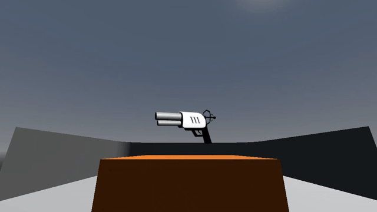

# Zero Gravity
A zero gravity FPS where you play as an astronaut escaping the moon while fighting aliens and robots.

[](https://www.youtube.com/watch?v=sDN9pQ0cDxA&list=PLBxdPMx2Fuus6cCLVT-m9N_i5JQsvjVaC)

*This project is under development (10/12/2025)*

## Project Overview
This game is made using Godot 4.2. It currently features:
- Weapon inventory system
- Grappling mechanic
- Simple enemy AI

One of the biggest challenges was designing the architecture in a way that allows scalability and modularity. So, I defined classes and modules for composition.
For example, the player node is a `Player` class containing a Camera Module, Inventory Module, and a Grapple Hook Module.

Players and enemies are state machines, switching between scripts depending on their state (e.g. Player has FLOATING, GRAPPLING, and GROUNDED).

## Setup:
1. Install prerequisites:
	- Godot 4.2+ (newer versions may break)
	- Git (optional)
2. Clone repo (optional)
	```bash 
	git clone https://github.com/leoQuin3/zero-gravity-game.git
	```
2. Alternatively, you can just *Download ZIP* and extract it from there.
3. Open Godot.
4. Click *Import* (Ctrl + I).
5. Find directory to project folder `zero-gravity-game/`
6. Click *"Select Current Folder"*.
7. Once project path is found, click *Import & Edit*.
8. *Run Project* (F5).


